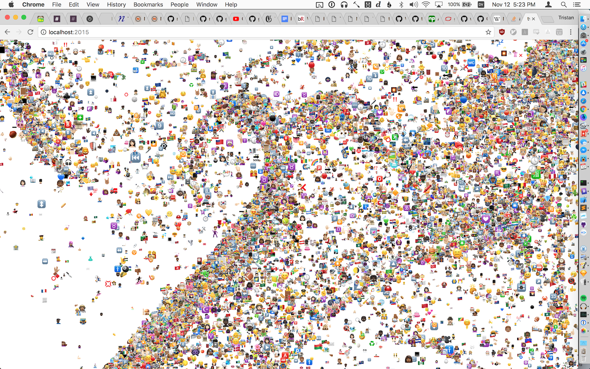

# EmojiEngine

EmojiEngine (also known as :cry: Engine) is the world's best video game rendering engine for emoji, and only emoji. It's built with WebGL and can render 90,000 emoji at 60fps. It was built for [TerribleHack X](http://terriblehack.website/), Waterloo's terrible ideas hackathon.

## Features

- Varying sizes
- Many different emoji
- Retina display ready
- Mouse control
- Keyboard controls
- Handles screen resizing

## Performance Tricks

- Uses GL point sprites to avoid sending too much geometry
- Uses a mip-mapped sprite sheet for fast rendering of emoji at different scales.
- Renders the emoji front to back with depth testing to completely avoid overdraw.
- Binary transparency by dropping fragments, no need for alpha blending.
- Processes state updates entirely using linear iteration over JS typed arrays, so that even updating everything every frame in JS is fast.
